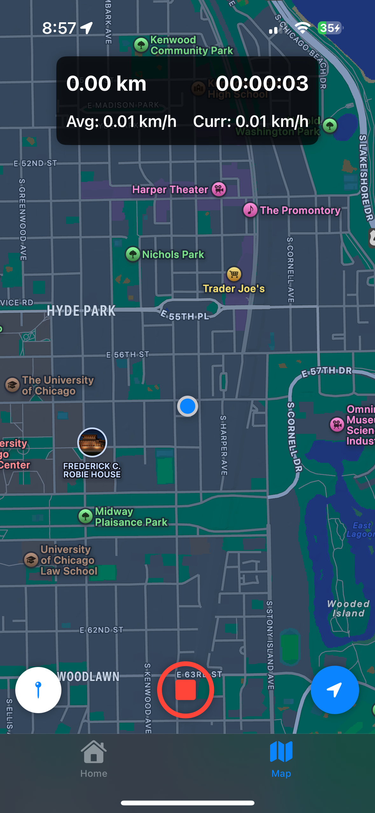
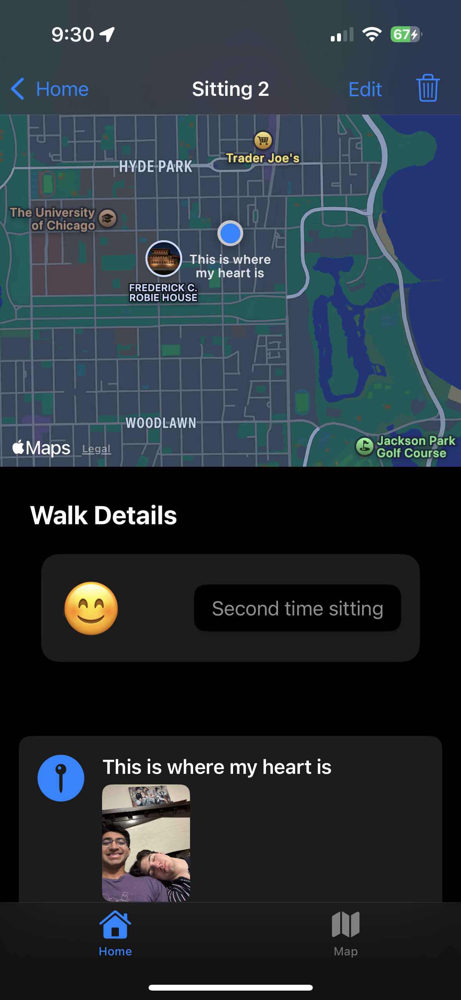
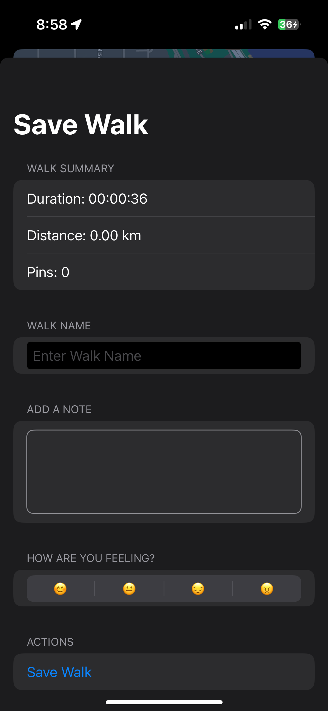
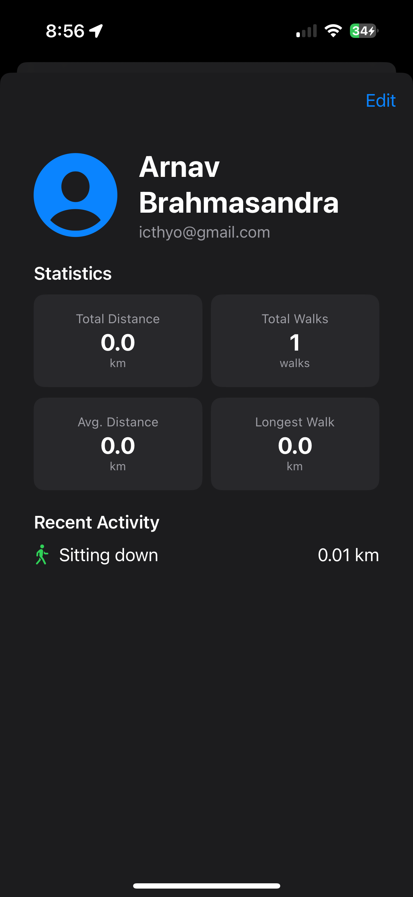
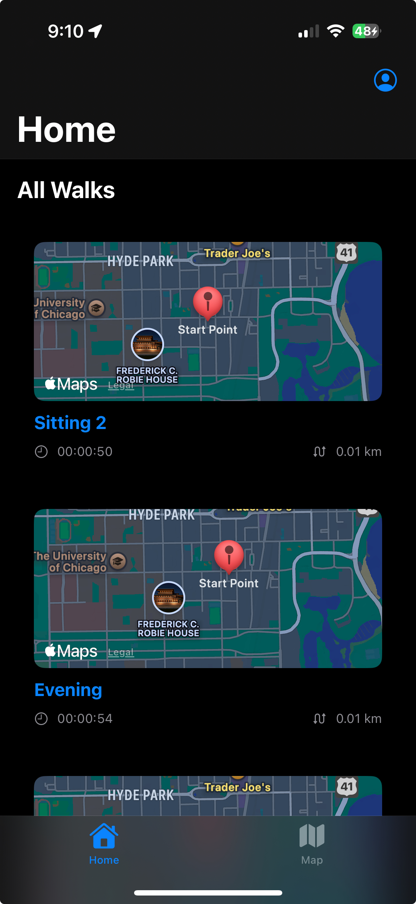

# Walkr - Track Your Walks

Walkr is a simple and intuitive iOS app designed to help you track your walks, save locations, add notes, and attach images along the way. Whether you're exploring a new city, hiking a trail, or just taking a stroll, Walkr ensures you can capture and relive your journey with ease.

## Features

- **Track Your Walks**: Record your walking route using GPS and visualize it on a map.
- **Save Locations**: Drop pins at specific points of interest during your walk.
- **Add Notes**: Attach notes to each pin to remember important details.
- **Attach Images**: Capture and save images at any location along your walk.
- **Walk Details**: Add a feeling (emoji) and a general note for the entire walk.
- **Edit Walk Title**: Customize the title of your walk for easy reference.
- **Core Data Integration**: All walks, pins, and associated data are saved locally using Core Data.
- **MapKit Integration**: Visualize your walks and pins on an interactive map.

## Screenshots

### Track your walk and drop pins along the way



### View saved pins with notes and images



### Save walk details and add a feeling or general note



### View and edit your profile



### View your walk history and relive your journeys



## Frameworks Used

Walkr is built using only **Core Data** and **MapKit**:

- **Core Data**: Used for local data persistence. All walks, pins, notes, and images are stored in a Core Data database.
- **MapKit**: Used to display the map, track the user's location, and visualize the walking route and pins.

There are **no third-party libraries** used in this project, making it lightweight and easy to maintain.

## Getting Started

### Prerequisites

- Xcode 14 or later.
- iOS 16 or later.
- A device with GPS capabilities (for accurate location tracking).

### Installation

1. Clone the repository:
   ```bash
   git clone https://github.com/yourusername/Walkr.git
   ```
2. Open the project in Xcode:
   ```bash
   cd Walkr
    open Walkr.xcodeproj
    ```
3. Build and run the project on a simulator or device.

### Usage

1. **Start a New Walk**:
   - Tap the "Play" button to begin tracking your route.

2. **Add Pins**:
   - During your walk, tap the Pin button to drop a pin at your current location.
   - Add a note or attach an image to the pin.

3. **Save Your Walk**:
   - After finishing your walk, view the route and pins on the map.
   - Add a title, feeling, and/or general note for the entire walk.
   - Tap the "Save" button to store the walk in your history.

4. **Save and Relive**:
   - All walks are saved automatically using Core Data.
   - Revisit your walks anytime to relive your journey.

## Contributing

Contributions are welcome! If you'd like to contribute to Walkr, please follow these steps:

1. Fork the repository.
2. Create a new branch for your feature or bugfix.
3. Commit your changes.
4. Submit a pull request.

## Acknowledgments

- Built with ❤️ using SwiftUI, Core Data, and MapKit.
- Inspired by the joy of exploring and capturing memories.

---

Enjoy tracking your walks with Walkr! 🚶‍♂️📍
